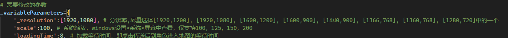

## 说明 ＆ 叠甲声明：
* 该脚本是基于pyautogui制作的**星穹铁道自动化锄大地**脚本，本质上属于模拟键鼠操作，未进行任何内存数据的读取或修改
* 虽然星穹铁道这种弱联网游戏即使刷取世界资源并不会导致游戏内的经济系统膨胀或紊乱，但米忽悠将该种脚本认定为第三方外挂也是可能的，且由于操作的规律性，**被封号处理的可能性依然存在**，请自行决定是否使用，若账号被封，**概不负责**
* 由于该脚本并未对内存数据进行读取修改，而是模拟键鼠操作，故而在执行时，会受到电脑配置的影响，具体体现在可能出现一下情况：
    1. 加载地图的过慢，导致程序已经开始执行图内操作，而实际上游戏里还在加载页面
    2. 跑到某个图的某个地点时，会卡顿，导致后续操作对不上，而卡地形
    3. 地图界面加载时卡(没错，就是多级地图切换依据电脑配置有时会卡住)，导致没能点到传送 (←该问题现以额外增加地图点击传送点，等待点击传送的时间，很少能碰到了)
* **所以运行该脚本需要能够自己动手修改程序。**

## 准备步骤：
***
安装python：最简单的方法是去微软商店中直接安装python3

***
安装完毕后，***右键开始菜单*** 或 ***win+x***，打开 ***终端(管理员)*** 或 ***powershell(管理员)*** ，输入`python`，确定能够进入python命令行，然后输入`exit()`，退出python命令行，回到终端界面

***
输入`python -m pip install --upgrade pip`，等待pip更新完毕

***
安装所需的几个模块，-i后面为pip国内镜像源

`pip install pyautogui -i https://pypi.tuna.tsinghua.edu.cn/simple`

`pip install pydirectinput -i https://pypi.tuna.tsinghua.edu.cn/simple` 

`pip install pywin32 -i https://pypi.tuna.tsinghua.edu.cn/simple` 

`pip install opencv-python -i https://pypi.tuna.tsinghua.edu.cn/simple`

***
不知为何升级到python3.12后，安装pyautogui的时候没有安装pillow，需要手动安装下: 
 
`pip install pillow -i https://pypi.tuna.tsinghua.edu.cn/simple`

***
设置星穹铁道为1920*1080窗口化(已不强制需求)，其他分辨率请在`configuration.py`中修改_variableParameters中的‘_resolution’字段的值，若系统缩放非100%，也请在此处修改'scale'字段的值  

带队人物选择最好是下面的**推荐角色**，角色置于***非* 基座舱段**的其他位置，**保持在可操作界面**，脚本运行期间，队伍战斗最好别失败，若失败则该区域后续基本无法进行，只能等待脚本运行到下一区域继续  
|推荐选择|不推荐选择|
|:---:|:---:|
|娜塔莎|青雀|
|佩拉|驭空|
|符玄|三月七|
|阮梅|彦卿|
|艾丝妲|黑天鹅|
|布洛妮娅|克拉拉|
|寒鸦||
|||

其他我没有，未尝试，哈哈哈哈
***
下载ZIP并解压，
一切设置完毕后，即可使用**管理员权限**(pyautogui非管理员无法进行)运行`starRail.py`，推荐VSCode + code runner插件运行，如果是VSCode运行，**在打开文件夹时，一定要打开的是data目录的上一级目录，而不是starRailScript_main的上一级目录，(即打开的文件夹是starRailScript_main)**

>**重要：如果是VSCode运行，需要在VSCODE按下Ctrl+,(逗号)，打开VSCode设置页面，搜索python.terminal.executeInFileDir，然后打上勾**，该选项是指定运行python时，运行目录为文件目录，而不是打开目录

## 文件说明 & 授人以渔
***
>星穹铁道2.1版本

### **调整以使皮诺康尼白日梦酒店(梦境)地图可以正常运行**
暂未更新皮诺康尼的朝露公官和克劳克影视乐园行为逻辑
* `pathFinding.py`:
    * 修正了一些行动逻辑
* `starRail.py`:
    * 调整皮诺康尼选择地图的逻辑，使得能够正确选择区域

***
>星穹铁道2.0版本

### **跟随2.0版本更新,基本结束**
* 白日梦酒店(梦境)的行为逻辑，还差两个小房间，可能后续放弃左边两个小房间，太麻烦了，在匹诺康尼攻击怪物视角会发生变化，在加上小房间的旋转，人要晕了
* `pathFinding.py`:
    * 修改太卜司，丹鼎司，绥园，工造司，鳞渊境的一些逻辑，使得能攻击到一些修改了位置的小怪
    * 白日梦酒店(梦境)的运行逻辑基本完成，地图左上角的两个黄色房间未探索
* `configuration.py`:
    * 增加白日梦酒店(梦境)小区域的坐标

### **跟随2.0版本更新,未结束**
* 缺少白日梦酒店(梦境)的行为逻辑
* 修改注释方式，以便能在调用时直接查看注释
* `pathFinding.py`:
    * 增加筑梦边境，稚子的梦的行为逻辑，**暂未完成白日梦酒店(梦境)的行为逻辑**
    * 其中筑梦边境会少刷3个怪，稚子的梦会少刷1只怪，都是想要刷取需要大量操作，极容易影响到后续运行，故放弃
    * 修改禁闭舱段的一些操作，使得顺利运行
    * 修改`selectRegion()`函数体形式，将其中的内部函数统一提前，将函数主体统一放到最后，修改内部函数的函数名，减少理解成本
* `configuration.py`:
    * 增加匹诺康尼大地图的坐标
    * 增加匹诺康尼小区域的行为逻辑坐标
    * 修改`action()`函数，增加'QM'：退出小房间地图，'SP'：等待一段时间的行为判断，并抽离'wasd'的组合按键，将其他单一按键操作放置最后的`else`分支中
* `starRail.py`:
    * 修正`script()`中，for循环的大地图次数为4
    * 调整缩小地图和选择大地图的顺序，防止运行脚本时角色在匹诺康尼的小房间中

### **调整以使前三张图可以正常运行**
暂未更新皮诺康尼的行为逻辑，这次更新真的量大管饱，地图也好大，还没肝完，先修复使前三个大地图可以正常运行
* `configuration.py`:
    * 修正了各个大地图的坐标
* `starRail.py`:
    * 选择大地图前拖拽一下，以保证选择坐标正确

***
>星穹铁道1.6版本

### **增强兼容**
* `configuration.py`:
    * 增加对不同版本pyautogui返回的兼容，消除ImageNotFoundException错误

### **跟随1.6版本更新**
* `configuration.py`:
    * 修正了黑塔空间站区域的数量
    * 增加禁闭舱段的区域内传送坐标
* `pathFinding.py`:
    * 增加了禁闭舱段的两次行动逻辑

***
>星穹铁道1.5版本

### **需要修改的参数中增加了缩放字段**
* `configuration.py`:
    * _variableParameters中增加了scale字段，用于适配系统缩放不是100%时的情况

### **跟随1.5版本更新**
* `configuration.py`:
    * 修正了仙舟区域的数量
    * 增加绥园的区域内传送坐标
    * 修改了**工造司第二次**传送的坐标
* `pathFinding.py`:
    * 修改了**工造司第一次**的行动，删除了后续的无效操作(增加偃偶之形，饮月突破材料时就应该修改了，当时懒了)，以及工造司第二次的行动进行了一些微调
    * 增加了绥园的两次行动逻辑

***
>星穹铁道1.4版本

### **测试了一些其他远程人物对该脚本的贴合程度**
* `pathFinding.py`：
    * 修改了残响回廊的行动BUG
    * 修改了太卜司第三个传送的行动逻辑
* `configuration.py`:
    * 修改了1920*1080的战斗判断区域

### **跟随1.4版本更新**
朋友，输得一塌糊涂啊！静流都出来了，青雀才来了一只，我的青雀才3命，就差一个就有不求人了，青雀什么时候才能满命啊，くそgame！
* `starRail.py`:
    * 修复了一个小BUG，（当脚本运行初始区域region不为0时，后续大地图也从设置的region开始，已修复，修复后，后续大地图会从第一个战斗区域开始）
* `pathFinding.py`：
    * 已增加旧武器实验场，造物之柱（直接返回）
    * 因增加额外突破材料本，大矿区的怪物有些许变动，已更新行为逻辑
* `configuration.py`:
    * 修正雅利洛Ⅵ号的区域数量
    * 修改了常见分辨率的战斗检测的判断区域
    * action增加了‘caps’键（即大写键），游戏中的作用为调整视角为角色朝向

***
>星穹铁道1.3版本

### **跟随1.3版本更新**
米桑，你怎么这么爱在地图中间加地图，很有趣嘛:D
* `starRail.py`:
    * 鉴于亲爱的米桑就是喜欢在几个地图中间加地图，增加了DEBUG的判断，用于只去点击区域地图，而不进行区域内操作
    * 修改了`clickRegion()`方法中的细节，使得仙舟增加金人巷后依然能正确运行
* `pathFinding.py`：
    * 已增加金人巷（直接返回）
    * 因增加额外突破材料本，工造司和鳞渊境的怪物有些许变动，已更新行为逻辑
* `configuration.py`:
    * 修正仙舟的区域数量
    * 因PC端键鼠操作默认隐藏了底部提示，故修改了战斗检测的判断区域
    * 在`_checkFightEnd()`中增加判断，如果长时间无法检测到战斗结束，那么将点击一次屏幕，用处：战斗失败时，能继续清扫剩余地图

***
>星穹铁道1.2版本

### **跟随1.2版本更新**
* `starRail.py`:
    * 修复`仙舟`因增加区域而导致的选择区域的位置错误问题
    * 将`selectRegion()`的调用从`clickRegion()`方法中上提到了`script()`中
* `pathFinding.py`：
    * 已增加丹鼎司，鳞渊境的行动方案
    * 将其中的`_action()`方法和`_run()`方法剥离到了`configuration.py`中
    * 将`_clickRegion()`更名为`_clickTransmitPoint()`,并将其和`_region*()`方法转为`selectRegion()`的内部函数
    * `selectRegion()`和`_region*()`增加参数`node`，能够在Debug的时候，直接输入，选择要Debug的节点，不用像先前修改`for i in range()`中的参数
* `configuration.py`:
    * 增加其他分辨率的支持
    * 将`_checkFightEnd()`和`_run()`方法转为`action()`的内部函数，修改战斗检测判断为右下角区域的轮盘是否存在(1.3版本已更改)
    * 增加`_correct()`方法，当设置分辨率非`1920*1080`时，启动脚本时调用该函数，根据设置的分辨率按比例调整相应坐标

此次修改后，若窗口设置非`1920*1080窗口化`，需要在`configuration.py`中修改`_variableParameters的_resolution`字典值，设置为当前使用的窗口化大小
* 

***
>星穹铁道1.0版本

`starRail.py` 为点击大地图，及选择区域的代码，后续新增大地图或区域时，修改该文件及`configuration.py`中的坐标。该文件中的main函数为脚本启动函数

`configuration.py` 为一些参数，包括需要点击的坐标，设置地图加载等待时间，寻找到游戏窗口函数，和检测战斗是否结束

`pathFinding.py` 为区域内传送点点击操作及人物行动代码，该文件中的main函数为区域内操作Debug的函数，`_clickRegion()`为点击传送点的函数，`_action()`操作解析函数，x为横向视角转动，y为纵向视角转动，这两个后面跟的数值为转动角度，非精确操作，慎用，c为左键单击，地图内即为攻击，cf为检测战斗是否结束，后面跟的数值为检测间隔单位秒，f为f键，使用场景为进入画中，后面跟的数值为等待时间，其他按键操作，基本为'w''a''s''d'的组合，后面跟的第一个数值为操作时间，第二个若有任意数值，则为走路进行，没有第二个数值，则为跑步进行
